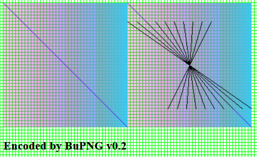
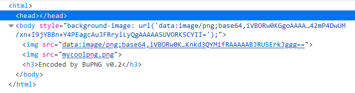

# BuPNG

BuPNG is a javascript library used to create *.png files in [Bun](https://github.com/oven-sh/bun). It is easy to use, zero-dependency, portable, has no legacy nor deprecated code.
The library is heavily based on the [qr-image](https://github.com/alexeyten/qr-image) project (which is unfortunately obsolete for several years), the most understandable implementation of png encoding I could find online. The project [pnglib-es6](https://github.com/IjzerenHein/pnglib-es6) was also helpful by "reverse engineering" of png image data from IDAT chunk.
The [PNG specification](http://www.libpng.org/pub/png/spec/1.2/PNG-Contents.html) describes the file format in details.

There is only one format of png data available, **RGB with alpha channel**, 8 bits per sample (8 * 4 = 32 bits per pixel), the same as *ImageData.data* property of a \<canvas\> element.

# Usage

```javascript
import { BuPNG } from './bupng';
const bp = new BuPNG(200, 200);

bp.plotPixel(10, 10[, 255, 0, 0, 255]); //x, y, R, G, B, a
bp.plotLine(10, 10, 100, 20[, 255, 0, 0, 255]); //x0, y0, x1, y1, R, G, B, a

console.log(bp.getBase64());
//data:image/png;base64,iVBORw0KGgoAAAANSUhEUgAAAMgAAADICAYAAACtWK6eAAAB...
//``

bp.saveFile('/path/to/your/web/site/public_html/mycoolpng.png');
//''

bp.version;
//BuPNG v0.2
```

# Example

It is assumed you have a web server (Nginx etc.) to serve static content and redirect other requests to Bun backend. To use `BuPNG.saveFile()` Bun must have write access to your *public_html* directiry.
```
    location / {
        try_files           $uri @bun;
    }

    location @bun {
        proxy_pass          http://127.0.0.1:3033;
        proxy_set_header    Host $host;
    }
```




See [example.js](example.js).

# Benchmark

BuPNG renders about 30-40 png files with size of 1000x1000 px in one second on one 2600 MHz virtual CPU core. See [benchmark.js](benchmark.js).
